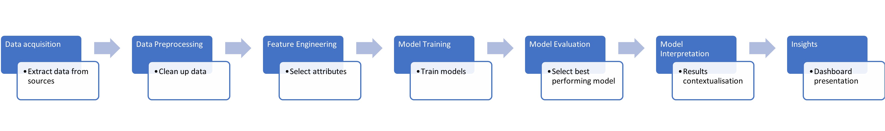
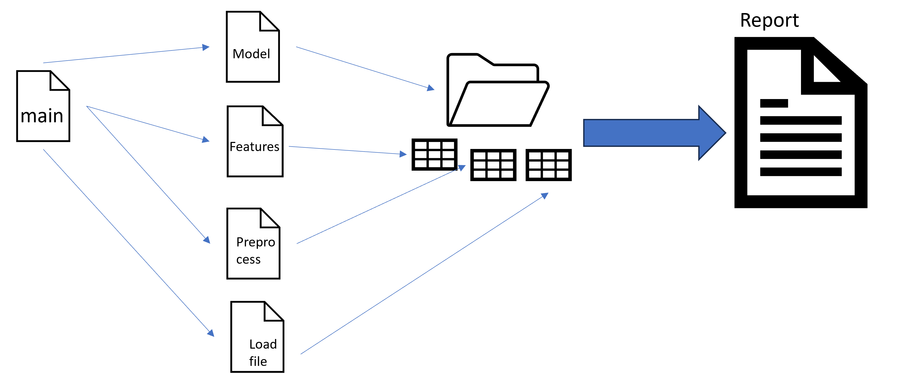
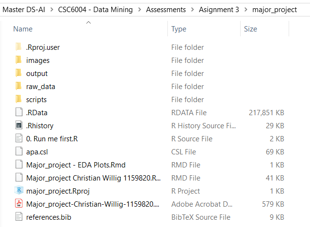
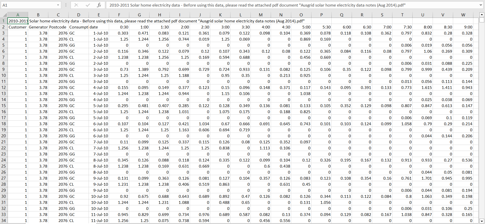

```{r setup, include=FALSE}
knitr::opts_chunk$set(echo = TRUE)

library(dplyr)
library(tidyr)
library(ggplot2)
library(RColorBrewer)
library(ClusterR)
library(cluster)
```

\newpage

# Project option and topic selection

The purpose of this report is to use data mining methods and implement them on a problem. We have selected option 2 which will use a data mining method for clustering residential energy demand data from the electricity company Ausgrid in New South Wales. The objective is to create customer's usage profiles that can be used by Ausgrid's demand response initiatives.  


# Background and motivation

In the last 10 years, the global energy landscape has gone through a significant push towards distributed renewable energy sources. Solar panels, wind turbines, and other decentralized energy generation methods are becoming increasingly prevalent. These distributed sources offer numerous benefits, including reduction of greenhouse gas emissions, better energy security, and potential cost savings. However, their integration into existing electricity grids presents new challenges.

Within this context, understanding residential load profiles is essential. The residential sector already accounts for a substantial portion of total electricity consumption, and this share continues to grow. According to data from the Australian Department of Climate Change, Energy, Environment, and Water, residential electricity usage constitutes approximately 24% of the total energy demand [@DCCEEW]. As more households adopt rooftop solar panels and battery storage systems, the dynamics of residential load profiles become increasingly complex.

Electricity distribution companies find themselves at the forefront of managing these changes. Their task involves maintaining stable power grids while accommodating the intermittent nature of renewable energy sources. Low voltage networks, which primarily serve residential customers, play a crucial role in this process. However, these networks face challenges related to load fluctuations, peak demand periods, and the need for infrastructure upgrades.

To address these challenges, effective energy usage and management strategies are paramount. These strategies hinge on a deep understanding of electricity usage behavior across different consumer groups. Precise segmentation of residential load profiles becomes critical for optimizing grid operations, minimizing disruptions, and ensuring reliable service delivery.

Demand-side management (DMS) programs play a pivotal role in achieving these goals. DMS refers to a set of strategies aimed at managing electricity demand efficiently. By targeting specific customer segments, utilities can tailor their approaches to meet diverse needs. Customer segmentation allows for personalized interventions, such as time-of-use pricing, load shifting, and demand response initiatives.

As more people adopt electric vehicles, smart appliances, and home automation systems, managing peak demand becomes increasingly challenging. During peak hours, when everyone simultaneously uses electricity, the strain on the grid intensifies. Utility companies must balance supply and demand to prevent power outages and maintain grid stability. Investing in infrastructure upgrades to handle peak loads is costly and often unsustainable.

One specific component of DMS is demand response (DR). DR programs encourage consumers to adjust their electricity usage based on grid conditions. Participants receive financial incentives for shifting their consumption away from peak periods. This aligns individual behavior with grid stability, benefiting both consumers and the environment.

In summary, effective management of residential load profiles, customer segmentation, and demand-side strategies are crucial for a sustainable energy future. As we continue to embrace renewable energy sources, thoughtful planning and innovative approaches will ensure that our energy system remains resilient, efficient, and environmentally friendly.


# Problem formulation

As stated in [@Willig_2024] the primary objective is to identify distinct subgroups within the data that could potentially reveal patterns or trends in energy consumption. This task will be approached using data mining techniques, specifically clustering algorithms, which are designed to group similar data points together based on certain characteristics.

Customer segmentation is relevant for utility companies as it helps them in many fronts by designing and implementing initiatives that prevent big peaks in the network. These initiatives not only benefit the business but also the customer by lowering their bill.

This report will be developed using a dataset provided by Ausgrid, a utility company in New South Wales. Data has been cleaned and put available online to be used by any party. Data has been anonymised. 

However, some challenges will need to be thought out during the resolution of this problem. 

* Data size will have pose a computational challenge and considering that the dataset's granularity is half-hourly consumption then feature engineering will be a relevant aspect of this problem. 

* The number of clusters is unknown at this moment so this will require careful consideration and several experiments.

* Interpretability of the results is crucial. While the clustering algorithm might identify distinct groups, deriving meaningful insights from these clusters and linking them back to real-world implications will be a complex task that requires domain knowledge and careful analysis.

* Selection of the appropriate method will be challenging as there are many options. Having said that, initial experimentation will be informed by the literature review.


# Literature review

Load profile segmentation has been studied by several researchers. In particular, clustering domestic load consumption has shown benefits in different use cases for utility companies. [@Beckel_et_al_2014] and [@McLoughlin_et_al_2012] used it to ensure that experiments encompassed a sample that accurately represented the population of study, allowed an experimenter to modify the outcome to account for any biases in their sample and to determine the factors and features that have a correlation with the use of energy. [@Flath_et_al_2012] used it to assist in analysing and formulating more tariff option rates and [@Rasanen_Kolehmainen_2009; @Stephen_et_al_2014] used it to create more accurate customer profiles. [@Cao_Beckel_Staake_2013; @Albert_Rajagopal_2013; @Dent_Aickelin_Rodden_Craig_2012; @Kwac_et_al_2014] used it to determine the customers that are suitable for energy saving measures such as demand response.

Different data mining techniques exists for clustering and have been used by researchers. Some of these methods are K-means and k-medoids [@Flath_et_al_2012, @Rasanen_Kolehmainen_2009; @Dent_Aickelin_Rodden_Craig_2012; @Benitez_et_al_2014], finite mixture models [@Stephen_et_al_2012; @Stephen_et_al_2014], principal component analysis [@Abreu_et_al_2012], Self-organising maps [@Beckel_et_al_2014] and spectral clustering [@Albert_Rajagopal_2013].


# Design and architecture

The proposed methodology uses data mining methods for extracting the clusters.

Computational complexity of data analysis increases exponentially with increase in size of data so we have taken this aspect into consideration. 

The proposed design of the process consist of the following steps from [@Willig_2024]:

```{r process, echo=FALSE, out.width="90%", fig.cap="Process Design", fig.align="center"}

```


* Step 1 aims to perform data collection and pre-processing phase. The main goal here is to obtain the data in a way that is repeatable and can be easily manipulated for the functioning of the next steps.

* Step 2 aims to preprocess the data to perform exploratory data analysis and learn from the structure of the data.

* Step 3 aims to take those learnings from step 2 and select or create features that can be use by the clustering method.

* Step 4 aims to analyse all the learnings from previous steps, use a clustering method to find groups within the data.

* Step 5 aims to assess and evaluate the quality of the clusters found by the data mining method.

* Step 6 aims to take the newly-created groups and interpret them to facilitate their understanding and communication.

* Step 7 aims to put all the findings and insights into a report that can be reproduceable and shared.

And the architecture of the solution is depicted in Figure \@ref(fig:architecture). In a nutshell, the solution is orchestrated by a main script that will execute the different steps in the process. Each step will save their output into a folder which later will be read by the main report code in order to present the findings.

```{r architecture, echo=FALSE, out.width="90%", fig.cap="Solution Architecture", fig.align="center"}

```


# Datasets

The energy consumption dataset utilised in this report comprises of customers with Solar PV systems in NSW, Australia. It has been provided by the utility company Ausgrid via the Ausgrid Solar Home Electricity project. It consists of energy consumption, controlled load and generation intervals for 365 days from July 1, 2010, to June 30, 2013. After processing and pseudonymizing the raw data, the company provided the dataset for research purposes.

## Exploratory Data Analysis

The dataset provided by Ausgrid contains records of 30-minute electricity consumption (GC), controlled load (CL) and electricity generation (GG) for 300 customers. Three years total aproximately over 40 million records (300 customers x 3 consumption types x 48 intervals x 365 days x 3 years), however, given the scope of our research and the size of the dataset we have applied the following filters and aggregations: 

* Filter consumption category GC (only General Consumption).
* Processed data from July 1, 2010 to June 30, 2011 (only one year of data).

We started by exploring the dataset to analyse its structure, distributions and dimensions. For this purpose we have processed and aggregated the time series dataset over different periods: different times of the day like weekdays, and weekends, monthly, seasonality and annually.

Figure \@ref(fig:daily-plot) shows the average daily demand at different intervals of the day for the whole year. It can be seen that the graph shows three main periods where a change in the demand trend happens: early in the morning (6am to 9am) and then during the evening (3pm to 10pm). 

```{r echo=FALSE}
daily_mean_annual <- readRDS("output/data/daily_mean_annual.rds")
daily_mean_monthly <- readRDS("output/data/daily_mean_monthly.rds")
daily_mean_annual_by_dayname <- readRDS("output/data/daily_mean_annual_by_dayname.rds")
daily_mean_annual_by_weektype <- readRDS("output/data/daily_mean_annual_by_weektype.rds")
```

```{r daily-plot, fig.cap="Aggregated daily mean annual consumption of consumers.", echo=FALSE, message=FALSE, warning=FALSE, out.width="90%", fig.align="center"}
daily_mean_annual %>% 
  ggplot() + 
  geom_col(aes(x=time2, y=value)) + 
  labs(
    title = "Daily Mean Annual Consumption"
    # caption = "Fig 1: Aggregated daily mean annual consumption of consumers"
  ) + 
  xlab(label = "Time intervals (30 mins)") +
  ylab(label = "Total Consumption (kwh") + 
  geom_vline(xintercept = c(12,20,30,45), linetype = 2, size = 1) + 
  annotate("text", x = 15, y = 0.47, label = "demand") + 
  annotate("text", x = 15, y = 0.44, label = "increase") + 
  annotate("text", x = 24, y = 0.47, label = "slight") + 
  annotate("text", x = 25, y = 0.44, label = "demand increase") + 
  annotate("text", x = 33, y = 0.55, label = "demand") + 
  annotate("text", x = 33, y = 0.52, label = "increase")

```


Figure \@ref(fig:daily-by-month) shows the average monthly demand of customers. The graph shows that June, July and August are the highest in demand across the year. We can see the during those three months two notorious peak happen in the morning (probably during breakfast) and later in the evening. And although they show two peaks, there is drop in demand during the day. On the contrary, January and February are the only two months that have different patterns.

```{r daily-by-month, echo=FALSE, message=FALSE, warning=FALSE, fig.cap="Aggregated daily mean annual consumption of consumers by months", out.width="90%", fig.align="center"}
daily_mean_monthly %>% 
  ggplot() + 
  geom_line(aes(x=time2, y=value, colour = month_name), size = 1) + 
  labs(
    title = "Daily Mean Annual Consumption by Months",
    colour = "Months"
  ) + 
  xlab(label = "Time intervals (30 mins)") +
  ylab(label = "Total Consumption (kwh") +
  scale_color_brewer(palette = "Paired")
```


Figure \@ref(fig:daily-by-weekday) shows the behaviour of the different days of the week on the demand. It can be seen that the two weekend days are close together and the days from the rest of the week are also together following the same pattern and intensity. However, Sunday is clearly the day that pushes consumption up during daytime.

```{r daily-by-weekday, echo=FALSE, message=FALSE, warning=FALSE, fig.cap="Aggregated weekday mean annual consumption of consumers by weekday", out.width="90%", fig.align="center"}
level_order <- c("Monday", "Tuesday", "Wednesday", "Thursday", "Friday", "Saturday", "Sunday")
daily_mean_annual_by_dayname %>% 
  ggplot() + 
  geom_line(aes(x=time2, y=value, colour = factor(day_name, levels = level_order)), size = 1) + 
  labs(
    title = "Daily Mean Annual Consumption by weekday",
    colour = "Weekday"
  ) + 
  xlab(label = "Time intervals (30 mins)") +
  ylab(label = "Total Consumption (kwh") +
  scale_color_brewer(palette = "Paired")
```

Figure \@ref(fig:daily-by-weektype) shows the consumption behaviour at a slightly higher level, weekend and weekdays. The effect of the weekend can be seen clearly affecting breakfast followed by daytime, with almost no impact in the night.

```{r daily-by-weektype, echo=FALSE, message=FALSE, warning=FALSE, fig.cap="Aggregated daily mean annual consumption of consumers by week type.", out.width="90%", fig.align="center"}
daily_mean_annual_by_weektype %>% 
  ggplot() + 
  geom_line(aes(x=time2, y=value, colour = weektype), size = 1) + 
  labs(
    title = "Daily Mean Annual Consumption by week type",
    colour = "Week type"
  ) + 
  xlab(label = "Time intervals (30 mins)") +
  ylab(label = "Total Consumption (kwh") +
  scale_color_brewer(palette = "Paired")
```

## Feature extraction and selection

Motivated by Haben et. al, (2016), four time periods were defined which help in identifying patterns of consumption among customers.

* Time period 1 (TP1) - Overnight: 10pm - 6am
* Time period 2 (TP2) - Breakfast: 6am - 10am
* Time period 3 (TP3) - Daytime: 10am - 4pm
* Time period 4 (TP4) - Evening: 4pm - 10pm

After creating the time periods we plotted the total demand by time period (see Figure \@ref(fig:tot-usage-tp) and we noticed some peaks occurring on specific days during the evening and daytime. These particular large demands happened on January 26th, and the 1st, 3rd, 5th and 6th of February 2011. The first date is clearly due to Australia day. The other dates in February could be related to the extreme summer conditions that occurred on that month of the year. According to the Australian Bureau of Meteorology [@Sydney_in_February_2011] February 2011 in Sydney was the second warmest month on record since 1998. These dates would be better removed from the dataset to ensure that we are working with typical customer behaviour.

```{r tot-usage-tp, echo=FALSE, message=FALSE, warning=FALSE, fig.cap="Total usage for each time period.", out.width="90%", fig.align="center"}
daily_sum_annual_by_time_period <- readRDS("output/data/daily_sum_annual_by_time_period.rds")

ann_text <- data.frame(
  date = c(as.Date("2011-02-05"), as.Date("2011-02-01"), as.Date("2011-02-15"), as.Date("2011-01-20"), as.Date("2011-01-26"), as.Date("2011-02-05"), as.Date("2011-02-06")),
  value = c(4938.042, 4528.685, 3932.154, 3837.449, 3510.621, 4090.620, 2897.830),
  lab = c("Feb 5", "Feb 1", "Feb 3", "Feb 2", "Jan 26", "Feb 5", "Feb 6"),
  time_period = c("evening", "evening", "evening", "evening", "evening", "daytime", "daytime")
)

daily_sum_annual_by_time_period %>%
ggplot(aes(x=date, y=value)) +
  geom_area( fill="#69b3a2", alpha=0.4) +
  geom_line(color="#69b3a2", size=1) +
  facet_wrap(vars(time_period)) + 
  geom_text(data = ann_text, label = ann_text$lab) +
  ylab(label = "Total demand (kWh")
```


Considering the dataset size we opted for using what the authors in [@Haben_Singleton_Grindrod_2016] proposed to use. Then the following attributes over the entire year at the customer level were considered at different periods, seasons and weekdays and weekends:

* Relative mean power during time periods (rmp_*): Average consumption during each time period (breakfast, daytime, evening, overnight) relative to the total average consumption.

$$rmp\_* = \frac{u_i}{\hat{u}}$$

* Mean Relative Standard Deviation (mrsd): Relative standard deviation considering different time periods to measure the variability and irregularity of consumers.

$$mrsd = (1/4)\sum_{i=1}^{4} \frac{\sigma_i}{u_i}$$

* Seasonal Score (sscore): Difference in the consumption over the summer and winter seasons, proportional to the average demand over the year.

$$sscore = \sum_{i=1}^{4} \frac{|u_i^W\ -\ u_i^S|}{u_i}$$

* Weekend vs weekday score (wdscore): Difference in the conusmption over the weekend and weekday proportional to the average demand over the year.

$$wdscore = \sum_{i=1}^{4} \frac{|u_i^{WE}\ -\ u_i^{WD}|}{u_i}$$

Notations:
\begin{align*}
& u_i\ is\ the\ mean\ demand\ in\ each\ time\ period\ (i=1,2,3,4)\ over\ the\ year. \\
& \sigma_i is the standard\ deviation\ in\ each\ time\ period\ (i=1,2,3,4)\ over\ the\ year. \\
& \hat{u}\ is\ the\ mean\ demand\ of\ the\ customer\ over\ the\ year. \\
& u_i^W\ is\ the\ mean\ demand\ in\ the\ Winter\ season\ in\ each\ time\ period\ (i=1,2,3,4). \\
& u_i^S\ is\ the\ mean\ demand\ in\ the\ Summer\ season\ in\ each\ time\ period\ (i=1,2,3,4). \\
& u_i^{WD}\ is\ the\ mean\ demand\ on\ WeekDays\ in\ each\ time\ period\ (i=1,2,3,4)\ over\ the\ year.. \\
& u_i^{WE}\ is\ the\ mean\ demand\ on\ WeekEnds\ in\ each\ time\ period\ (i=1,2,3,4)\ over\ the\ year. \\
\end{align*}


After creating these new features we ended up with a dataset of 300 records and 7 features, as shown in table \@ref(tab:featurestable) below.

```{r featurestable, echo=FALSE}
df_features <- readRDS("output/data/df_features.rds")

knitr::kable(head(df_features), caption = "First 6 records of dataset with the new features.")
```


# Modeling

We can see in Figure \@ref(fig:features-distributions) that all features follow the Gaussian distribution, so a **Gaussian Mixture Model (GMM)** seems to be suitable for our dataset.


```{r features-distributions, echo=FALSE, fig.cap="Feature distributions", message=FALSE, warning=FALSE}
df_features %>% 
  pivot_longer(cols = rmp_overnight:wdscore, names_to = "features") %>%
ggplot(aes(x = value)) + 
  geom_histogram(aes(y = ..density..),
                 colour = 1, fill = "white") +
  geom_density(lwd = 1, colour = 4,
               fill = 4, alpha = 0.25) +
  xlab(label = "Features") +
  facet_wrap(~features, scales = "free")
```

The GMM model is a soft clustering method used in data mining to determine the probability that a given data point belongs to a cluster. One important parameter for the model is to determine beforehand the number of clusters. The approach we followed was to try different values of clusters and treat the best value as a model selection problem. To assess the performance of the model given a cluster value, we have opted to use a combination of metrics, the BIC (Bayesian Information Criterion) for being a good indicator for GMM clustering [@Gogebakan_et_al_2018] and Silhouette with Davies-Boulding scores for being the best indices for cluster validation [@Rousseeuw_1987].


```{r bicplot, echo=FALSE, message=FALSE, warning=FALSE, fig.cap="BIC scores by cluster size."}
df_gmm_optimal <- readRDS("output/data/df_gmm_optimal.rds")

df_gmm_optimal %>% 
    ggplot(aes(x=factor(clusters), y=BIC)) + 
    geom_point() + 
    geom_line(group = 1, size = 1) + 
    geom_text(aes(label=round(BIC,1)), vjust="inward", hjust="inward") + 
    xlab(label = "Clusters")

```


We started with the BIC score depicted in Figure \@ref(fig:bicplot) above. We can see that there are a couple of flat areas where the score doesn't change much. The lowest value is at cluster 14. However, having too many clusters will make interpretation harder and more difficult to understand. In order to pick a cluster, we think that having a cluster between 4 and 9 might be a good number. So we calculated the silhouette and Davies-Boulding scores for cluster values 5, 6, 7, 8 and 9 and concluded that 6 clusters provides the best scores (0.15 and 1.62).

The number of customers per cluster is shown in Table \@ref(tab:clustersize).


```{r clustersize, echo=FALSE}
customers_by_cluster <- readRDS("output/data/customers_by_cluster.rds")

knitr::kable(customers_by_cluster, caption = "Customers by cluster.")
```

\newpage

# Snapshots

The following snapshots correspond to the components that make this research project reproducible:

## Project folder

The project folder contains all the files needed for the report to run.

```{r echo=FALSE, message=FALSE, warning=FALSE, out.width = "60%", fig.align = "center"}


```

**Folders**

* images: contains all images used in the report.
* output: contains all the output objects created by the scripts.
* raw_data: contains all the half-hourly (30 minutes) interval data used for the project.
* scripts: contains all the R scripts that run the solution steps.

**Files**

* 0.Run me first.R: This file contains all the R code that executes the solution steps and produce the dataframe outputs.
* apa.csl: This file contains the citation style used in the document. Currently using APA7.
* Major_project Christian Willig 1159820.Rmd: This file contains all the code and writing that generates the PDF report.
* major_project.Rproj: This file contains the project structure that RStudio uses to read the project folder.
* Major_project-Christian-Willig-1159820.pdf: This is the output file after .Rmd file is compiled and run.
* references.bib: This file contains all the references used in the report. The .Rmd file uses this files together with the .csl file to write the reference section.


## Images Folder

This folder contains all the images used in the report.

```{r echo=FALSE, out.width = "60%", fig.align = "center"}
knitr::include_graphics(c("./images/images_folder.PNG"))
```


## Output Folder

This folder contains all the dataframes that get generated by the R scripts and used by the .Rmd file.

```{r echo=FALSE, out.width = "60%", fig.align = "center"}
knitr::include_graphics(c("./images/output_dataframes.PNG"))
```


## Raw data Folder

This folder contains the raw datafiles provided by Ausgrid. The zip and unzip files are contained.

```{r echo=FALSE, out.width = "50%", fig.align = "center"}
knitr::include_graphics(c("./images/raw_data_folder.PNG"))
```

## Scripts Folder

This folder contains the R scripts that run all the different steps in the solution: data acquisition, data processing, feature engineering and data modeling.

```{r echo=FALSE, out.width = "50%", fig.align = "center"}
knitr::include_graphics(c("./images/scripts_folder.PNG"))
```

### Data processing Script File

This file (.R) is contained in the 'Scripts' folder and it reads the raw data and saves it into the output folder.

```{r echo=FALSE, out.width = "50%", fig.align = "center"}
knitr::include_graphics(c("./images/reading_file.PNG"))
```

### Data Summaries Script File

This file (.R) is contained in the 'Scripts' folder and it calculates all the summary datasets needed to perform the initial analysis. Then it saves the dataframes into the output folder.

```{r echo=FALSE, out.width = "50%", fig.align = "center"}
knitr::include_graphics(c("./images/summary_file.PNG"))
```

### Feature Engineering Script File

This file (.R) is contained in the 'Scrips' folder and it calculates all the new features before running the clustering method. Then it saves the dataframes into the output folder.

```{r echo=FALSE, out.width = "50%", fig.align = "center"}
knitr::include_graphics(c("./images/feature_engineering_file.PNG"))
```

### Data Modeling Script File

This file (.R) is contained in the 'Scrips' folder and it calculates the new clusters via a clustering algorith. Then it saves the dataframes into the output folder.

```{r echo=FALSE, out.width = "50%", fig.align = "center"}
knitr::include_graphics(c("./images/data_modeling_file.PNG"))
```


## Initial Script File

This file contains the R code that executes the steps and saves the outputs into the output folder. The output dataframes are then used by the report.

```{r echo=FALSE, out.width = "50%", fig.align = "center"}
knitr::include_graphics(c("./images/main_script.PNG"))
```

## APA File

This file (.csl) contains the style of the references to be used in the report. Currently is set up to use APA 7, however, it can be changed to another style if needed for the report references. We have used the following repository to find the styles that are needed: [Zotero Style Repository](https://www.zotero.org/styles)

```{r echo=FALSE, out.width = "50%", fig.align = "center"}
knitr::include_graphics(c("./images/apa7_format.PNG"))
```

## Major project File

This file (.Rmd) contains the markdown and code of the project. Once it's compiled it produces a PDF file containing the results of the project. 

```{r echo=FALSE, out.width = "50%", fig.align = "center"}
knitr::include_graphics(c("./images/report_source_code.PNG"))
```

## References File

This file is the database of references which holds all the papers, journals and websites that were used in the project. It's used by the Major project file (rmarkdown) to put together the reference section automatically in the style defined by the .csl file.

```{r echo=FALSE, out.width = "50%", fig.align = "center"}
knitr::include_graphics(c("./images/apa7_format.PNG"))
```

# Instructions

This report has been implemented in a way that it can be run again and obtain the same values. The main components of this report are:

* R libraries: these libraries do all the heavy lifting for the project: data manipulation, data modeling, report generation and reference management and implementation.
* R scripts: these files contain the main code that implements the clustering model over the dataset.
* RStudio: This is the software IDE used to run the scripts and produce the report's outputs.

The following steps need to be followed reproduce the results:

1. Unzip the project files into a folder anywhere in your computer.
2. open Rstudio and open the project from File - Open Project menu option. Select the file 'major_project.Rproj' and open it.
3. Once the project is open, run the script called '0.Run me firs.R'. This will set up all the corresponding libraries, folders, run the script and execute the data mining methods over the data.
4. Open file 'Major_project Christian Willig 1159820.Rmd' and click on the Knit button. This will execute the report and will generate a pdf of this report.

Note: As prerequisite RStudio and R need to be installed on the computer. This report has been tested to run on Windows only.

# Findings, lessons and experiences

## Findings

After settling with a cluster number the following profiles were studied and interpreted so they can be described in business terms that make sense to inform the Demand-Side Management strategies.

```{r cluster-summary-shapes, echo=FALSE, message=FALSE, warning=FALSE, fig.cap="Clusters summary shapes."}

clustered_data <- readRDS("output/data/clustered_data.rds")
profiles <- readRDS("output/data/profiles.rds")
cluster_centers <- readRDS("output/data/cluster_centers.rds")

time_intervals <- c("x0_30"="1", "x1_00"="2", "x1_30"="3", "x2_00"="4", "x2_30"="5", "x3_00"="6", "x3_30"="7", "x4_00"="8", "x4_30"="9",
                    "x5_00"="10", "x5_30"="11", "x6_00"="12", "x6_30"="13", "x7_00"="14", "x7_30"="15", "x8_00"="16", "x8_30"="17",
                    "x9_00"="18", "x9_30"="19", "x10_00"="20", "x10_30"="21", "x11_00"="22", "x11_30"="23", "x12_00"="24", "x12_30"="25",
                    "x13_00"="26", "x13_30"="27", "x14_00"="28", "x14_30"="29", "x15_00"="30", "x15_30"="31", "x16_00"="32", "x16_30"="33",
                    "x17_00"="34", "x17_30"="35", "x18_00"="36", "x18_30"="37", "x19_00"="38", "x19_30"="39", "x20_00"="40", "x20_30"="41",
                    "x21_00"="42", "x21_30"="43", "x22_00"="44", "x22_30"="45", "x23_00"="46", "x23_30"="47", "x0_00"="48")

ggplot(profiles) +
  geom_line(aes(x=as.numeric(time2), y=value), color = "black", linewidth = 2) +
  xlab(label = "Time Intervals (30 mins)") +
  ylab(label = "Total Demand (kWh)") +
  facet_wrap(vars(cluster))
```

### Cluster 1 (C1)

```{r c1-shape, echo=FALSE, message=FALSE, warning=FALSE, fig.cap="Cluster 1: center and customers shape"}
cl <- "C1"
clustered_data %>% 
  # mutate(customer == 15) %>%
  filter(cluster == cl) %>%
  pivot_longer(cols = x0_30:x0_00, names_to = "intervals") %>% 
  mutate(time2 = time_intervals[intervals]) %>% 
  arrange(as.numeric(time2)) %>%
  group_by(customer, time2) %>%
  summarise(value = mean(value)) %>%
  # summarize(value = entropy::entropy(value, unit = 'log10')) %>% 
  # filter(value <= 1) %>%
  ggplot() +
  geom_line(aes(x=as.numeric(time2), y=value, colour = factor(customer))) + 
  geom_line(
    data =(cluster_centers %>% filter(cluster == cl)),
    aes(x = as.numeric(time2), y = value), color = "black", linewidth = 2
  ) + 
  theme(legend.position = "none") + 
  xlab(label = "Time intervals (30 min") +
  ylab("Average demand (kWh)") +
  geom_vline(xintercept = c(13,21,33,45), linetype = 2, size = 1) +
  annotate("text", x = 5, y = 1.25, label = "TP1") +
  annotate("text", x = 17, y = 1.25, label = "TP2") +
  annotate("text", x = 26, y = 1.25, label = "TP3") + 
  annotate("text", x = 40, y = 1.25, label = "TP4")
```

The first cluster, as shown in Figure \@ref(fig:c1-shape), contains one third of the customers and it's biggest cluster. It presents a close to uniform demand during breakfast and daytime, reaching a peak demand during the evening and then again decreases overnight.

During weekdays the customers of this cluster experience an ealier demand in breakfast compared to weekends, however, once breakfast starts on the weekend, demand continues to be constant during daytime as well. On the contrary, demand drops in weekdays after breakfast. Peak demand during the evening are identical in both weekdays and weekends and also demand overnight are both low.

Consumption patterns remain the same across time periods during autumn and spring, however, summer and winter show differences in patterns pretty in all time periods except overnight. Summer though, is the season with the highest demand presenting two peaks, one during breakfast and another during the evening.


### Cluster 2 (C2)

```{r c2-shape, echo=FALSE, message=FALSE, warning=FALSE, fig.cap="Cluster 2: center and customers shape"}
cl <- "C2"
clustered_data %>% 
  # mutate(customer == 15) %>%
  filter(cluster == cl) %>%
  pivot_longer(cols = x0_30:x0_00, names_to = "intervals") %>% 
  mutate(time2 = time_intervals[intervals]) %>% 
  arrange(as.numeric(time2)) %>%
  group_by(customer, time2) %>%
  summarise(value = mean(value)) %>%
  # summarize(value = entropy::entropy(value, unit = 'log10')) %>% 
  # filter(value <= 1) %>%
  ggplot() +
  geom_line(aes(x=as.numeric(time2), y=value, colour = factor(customer))) + 
  geom_line(
    data =(cluster_centers %>% filter(cluster == cl)),
    aes(x = as.numeric(time2), y = value), color = "black", linewidth = 2
  ) + 
  theme(legend.position = "none") +
  xlab(label = "Time intervals (30 min") +
  ylab("Average demand (kWh)") +
  geom_vline(xintercept = c(13,21,33,45), linetype = 2, size = 1) +
  annotate("text", x = 5, y = 1.25, label = "TP1") +
  annotate("text", x = 17, y = 1.25, label = "TP2") +
  annotate("text", x = 26, y = 1.25, label = "TP3") + 
  annotate("text", x = 40, y = 1.25, label = "TP4")
```

Cluster 2 is the one with the least number of customers. As seen in Figure \@ref(fig:c2-shape), it's a very small cluster with high variability among its customers. Demand is pretty constant during the day with a small increment from overnight to breakfast and then a small peak during the evening.

Demand on the weekend follows the same pattern as in the weekdays, with the particularity that breakfast time starts later on the weekend.

Demand over the seasons is very variable. Winter presenting a higher demand over all time periods compared to the others seasons. However, daytime is reported to decrease after breakfast during winter which later during the eveing picks up again at similar demand levels as it was during breakfast.

### Cluster 3 (C3)

```{r c3-shape, echo=FALSE, message=FALSE, warning=FALSE, fig.cap="Cluster 3: center and customers shape"}
cl <- "C3"
clustered_data %>% 
  # mutate(customer == 15) %>%
  filter(cluster == cl) %>%
  pivot_longer(cols = x0_30:x0_00, names_to = "intervals") %>% 
  mutate(time2 = time_intervals[intervals]) %>% 
  arrange(as.numeric(time2)) %>%
  group_by(customer, time2) %>%
  summarise(value = mean(value)) %>%
  # summarize(value = entropy::entropy(value, unit = 'log10')) %>% 
  # filter(value <= 1) %>%
  ggplot() +
  geom_line(aes(x=as.numeric(time2), y=value, colour = factor(customer))) + 
  geom_line(
    data =(cluster_centers %>% filter(cluster == cl)),
    aes(x = as.numeric(time2), y = value), color = "black", linewidth = 2
  ) + 
  theme(legend.position = "none") + 
  xlab(label = "Time intervals (30 min") +
  ylab("Average demand (kWh)") +
  geom_vline(xintercept = c(13,21,33,45), linetype = 2, size = 1) +
  annotate("text", x = 5, y = 1.25, label = "TP1") +
  annotate("text", x = 17, y = 1.25, label = "TP2") +
  annotate("text", x = 26, y = 1.25, label = "TP3") + 
  annotate("text", x = 40, y = 1.25, label = "TP4")
```

This cluster is the second largest and as seen in Figure \@ref(fig:c3-shape) reports two peak demands during breakfast and the evening. The behavior of this cluster is very variable over the year, 

It can be observed as well that both weekdays and weekends have a similar pattern across the day with a few particularities. First, breakfast on weekends record lower demand than weekdays, and during daytime, the weekend period is higher than the weekday.

At a season level winter presents the highest demand in intensity. Autumn and spring show almost identical patterns and intensity. Summer meets demand and pattern during time period overnight and breakfast.

### Cluster 4 (C4)

```{r c4-shape, echo=FALSE, message=FALSE, warning=FALSE, fig.cap="Cluster 4: center and customers shape"}
cl <- "C4"
clustered_data %>% 
  # mutate(customer == 15) %>%
  filter(cluster == cl) %>%
  pivot_longer(cols = x0_30:x0_00, names_to = "intervals") %>% 
  mutate(time2 = time_intervals[intervals]) %>% 
  arrange(as.numeric(time2)) %>%
  group_by(customer, time2) %>%
  summarise(value = mean(value)) %>%
  # summarize(value = entropy::entropy(value, unit = 'log10')) %>% 
  # filter(value <= 1) %>%
  ggplot() +
  geom_line(aes(x=as.numeric(time2), y=value, colour = factor(customer))) + 
  geom_line(
    data =(cluster_centers %>% filter(cluster == cl)),
    aes(x = as.numeric(time2), y = value), color = "black", linewidth = 2
  ) + 
  theme(legend.position = "none") + 
  xlab(label = "Time intervals (30 min") +
  ylab("Average demand (kWh)") +
  geom_vline(xintercept = c(13,21,33,45), linetype = 2, size = 1) +
  annotate("text", x = 5, y = 1.25, label = "TP1") +
  annotate("text", x = 17, y = 1.25, label = "TP2") +
  annotate("text", x = 26, y = 1.25, label = "TP3") + 
  annotate("text", x = 40, y = 1.25, label = "TP4")
```

This cluster is the second smallest in terms of number of customers and as seen in Figure \@ref(fig:c4-shape) it's characterised by a high demand during the overnight period followed by a peak demand during breakfast. It also shows a low demand during daytime all the way to the evening where demand picks up again and continues to the overnight period.

This cluster experiences a similar demand pattern during the weekend and weekdays with a small difference in intensity during breakfast and daytime where weenkend has lower demand and higher demand respectively.

The cluster has similar demand patterns across all seasons but with certain differences in intensity, more notoriously during winter, where intensity is higher than the other seasons.

### Cluster 5 (C5)

```{r c5-shape, echo=FALSE, message=FALSE, warning=FALSE, fig.cap="Cluster 5: center and customers shape"}
cl <- "C5"
clustered_data %>% 
  # mutate(customer == 15) %>%
  filter(cluster == cl) %>%
  pivot_longer(cols = x0_30:x0_00, names_to = "intervals") %>% 
  mutate(time2 = time_intervals[intervals]) %>% 
  arrange(as.numeric(time2)) %>%
  group_by(customer, time2) %>%
  summarise(value = mean(value)) %>%
  # summarize(value = entropy::entropy(value, unit = 'log10')) %>% 
  # filter(value <= 1) %>%
  ggplot() +
  geom_line(aes(x=as.numeric(time2), y=value, colour = factor(customer))) + 
  geom_line(
    data =(cluster_centers %>% filter(cluster == cl)),
    aes(x = as.numeric(time2), y = value), color = "black", linewidth = 2
  ) + 
  theme(legend.position = "none") + 
  xlab(label = "Time intervals (30 min") +
  ylab("Average demand (kWh)") +
  geom_vline(xintercept = c(13,21,33,45), linetype = 2, size = 1) +
  annotate("text", x = 5, y = 1.25, label = "TP1") +
  annotate("text", x = 17, y = 1.25, label = "TP2") +
  annotate("text", x = 26, y = 1.25, label = "TP3") + 
  annotate("text", x = 40, y = 1.25, label = "TP4")
```

This Cluster contains the third lowest number of customers and as seen in Figure \@ref(fig:c5-shape) it's characterised by its peak demand during daytime and the evening as shown in the Fig. Overnight period is low and followed by an increase demand during breakfast.

Weekdays and weekends demand look pretty similar in terms of patterns and intensity, with a slight difference daytime and the evening.

### Cluster 6 (C6)

```{r c6-shape, echo=FALSE, message=FALSE, warning=FALSE, fig.cap="Cluster 6: center and customers shape"}
cl <- "C6"
clustered_data %>% 
  # mutate(customer == 15) %>%
  filter(cluster == cl) %>%
  pivot_longer(cols = x0_30:x0_00, names_to = "intervals") %>% 
  mutate(time2 = time_intervals[intervals]) %>% 
  arrange(as.numeric(time2)) %>%
  group_by(customer, time2) %>%
  summarise(value = mean(value)) %>%
  # summarize(value = entropy::entropy(value, unit = 'log10')) %>% 
  # filter(value <= 1) %>%
  ggplot() +
  geom_line(aes(x=as.numeric(time2), y=value, colour = factor(customer))) + 
  geom_line(
    data =(cluster_centers %>% filter(cluster == cl)),
    aes(x = as.numeric(time2), y = value), color = "black", linewidth = 2
  ) + 
  theme(legend.position = "none") + 
  xlab(label = "Time intervals (30 min") +
  ylab("Average demand (kWh)") +
  geom_vline(xintercept = c(13,21,33,45), linetype = 2, size = 1) +
  annotate("text", x = 5, y = 1.25, label = "TP1") +
  annotate("text", x = 17, y = 1.25, label = "TP2") +
  annotate("text", x = 26, y = 1.25, label = "TP3") + 
  annotate("text", x = 40, y = 1.25, label = "TP4")
```

This cluster is the third largest and is conformed by customers that show a pattern of low overnight (TP1) demand, which then continues to increase during breakfast (TP2) and finishes in its peak during the evening (TP4), most probably during dinner time. This is followed by a decrease in demand at night as shown in the Figure \@ref(fig:c6-shape). 

The consumption during daytime (TP3) is very flat on the weekends compared to weekdays where it drops after breakfast. 

The demand patterns during spring and autumm are very similar across all the time periods. Winter presents the highest demand during evening and a lower demand during the daytime period compared to breakfast. Summer on the contrary presents a similar demand to autumn and it has the highest demand of all seasons during the daytime.

## Lessons


* There is no one-size-fits-all approach when it comes to segmentation. Many methods exist in the literature, such k-means, hierarchical clustering, SOM and others. Each technique has its own strengths and limitations and it's our job as analysts to choose the most suitable method based on the problem characteristics and nature of the data.

* Interpreting clusters is hard to do without some knowledge of the business or problem being solved. Clustering is the technical part and profiling is the business interpretation of the clusters.

* Working with large datasets can be time-consuming. Cleaning, preprocessing and exploring data takes a lot of effort. Lesson here is to start with a small but representative sample to understand initial patterns and then scale up to the full dataset.

* Choosing the right algorithm is difficult. It's easy to fall into the trap of trying every method available. Lesson here is to focus on those methods relevant to the problem and consider the trade-offs between complexity and performance.

* It's very easy to get lost in experimentation without making meaningful progress. Lesson here is to find the right balance between exploration adn implementation. Set clear goals, allocate time for exploration and respect it. Regularly assess whether your efforts align with the research question, if not, pivot and refocus.


## Experience

The experience that I have gained by doing this assessment is very beneficial to my work as it gives me more confidence in the process of conducting an analysis of this type and present it to an audience whether is in a conference or a group of colleagues internally. In particular, I have presented this analysis to my manager and he found it so interesting that has asked me to presented in the next company's town hall which will an audience of 200 people.

# Conclusion

In conclusion, this report has examined the 30-min consumption patterns of a sample of 300 customers located in New South Wales, Australia. The data analysis was conducted using a Gaussian Mixture Model, a statistical method used in data mining that allows the identification of underlying groups within a sample.

The application of this model led to discover six distinct clusters, each exhibiting different consumption behaviours during specific time periods of the day (breakfast, daytime, evening and overnight). Each cluster represents a different customer group, with its own set of characteristics and consumption habits.

Armed with this valuable insight, utility businesses are now in a position to formulate and implement more effective strategies for demand-side management initiatives. These strategies can be tailored to the specific behaviours of each customer cluster, thereby increasing their effectiveness. This could potentially lead to improved customer satisfaction, more efficient resource allocation, and ultimately, a more successfull and sustainable business operation.

In essence, the data-driven insights derived from this report have the potential to significantly enhance the business's understanding of its customers. This, in turn, can lead to more informed decision-making and strategic planning, setting the stage for the business's future success in an increasingly competitive market.


# References

<div id="refs"></div>


\newpage

# (APPENDIX) Appendix {-}

# Raw Files Structure

```{r echo=FALSE, message=FALSE, warning=FALSE, out.width = "50%", fig.align = "center"}


```

# Source Code

## Reading.R

```{r eval=FALSE}
#Load libraries
library(tidyr)
library(dplyr)
library(readr)
library(lubridate)
library(janitor)


# Read data file.
# It contains a row with a text which is not part of the data.

raw_data <- read_csv("raw_data/1 July 2010 to 30 June 2011/2010-2011 Solar home electricity data v2.csv", 
                     col_types = cols(Postcode = col_character(), 
                                      date = col_character()), na = "NA", 
                     skip = 1)

# Set seasons
seasons <- c("Summer", "Summer", "Autumn", "Autumn", "Autumn", "Winter", "Winter", "Winter", "Spring", "Spring", "Spring", "Summer")


# Transformed data and added a couple of features to facilitate EDA
transformed_data <- raw_data %>% 
  clean_names() %>% 
  select(customer, consumption_category, date, x0_30:x0_00) %>% 
  filter(consumption_category %in% c('GC')) %>% 
  group_by(customer, date) %>% 
  summarise_at(vars(x0_30:x0_00), sum) %>% 
  mutate(date = dmy(date)) %>% 
  mutate(
    day_name = wday(date, label = TRUE, abbr = F),
    weektype = if_else(day_name %in% c('Saturday','Sunday'), 'Weekend', 'Weekday'),
    month_name = month(date, label = T, abbr = F),
    season = seasons[month(date, label = T)]
  ) %>% 
  relocate(
    day_name, month_name, weektype, season,
    .after = date
  ) %>% 
  arrange(customer, date) %>% 
  ungroup()

saveRDS(transformed_data, file = "output/data/readings.rds")
```

## Daily_mean_summaries.R

```{r eval=FALSE}
library(dplyr)

readings <- readRDS("output/data/readings.rds")

time_intervals <- c("x0_30"="1", "x1_00"="2", "x1_30"="3", "x2_00"="4", "x2_30"="5", "x3_00"="6", "x3_30"="7", "x4_00"="8", "x4_30"="9",
                    "x5_00"="10", "x5_30"="11", "x6_00"="12", "x6_30"="13", "x7_00"="14", "x7_30"="15", "x8_00"="16", "x8_30"="17",
                    "x9_00"="18", "x9_30"="19", "x10_00"="20", "x10_30"="21", "x11_00"="22", "x11_30"="23", "x12_00"="24", "x12_30"="25",
                    "x13_00"="26", "x13_30"="27", "x14_00"="28", "x14_30"="29", "x15_00"="30", "x15_30"="31", "x16_00"="32", "x16_30"="33",
                    "x17_00"="34", "x17_30"="35", "x18_00"="36", "x18_30"="37", "x19_00"="38", "x19_30"="39", "x20_00"="40", "x20_30"="41",
                    "x21_00"="42", "x21_30"="43", "x22_00"="44", "x22_30"="45", "x23_00"="46", "x23_30"="47", "x0_00"="48")

daily_mean_annual <- readings %>% 
  pivot_longer(cols = x0_30:x0_00, names_to = "intervals") %>% 
  mutate(time = hms::as_hms(paste0(gsub('_', ':', sub('.','',intervals)),':00')),
         time2 = as.numeric(time_intervals[intervals])) %>% 
  group_by(time2) %>% 
  summarise(value = mean(value)) %>% 
  arrange(time2)

saveRDS(daily_mean_annual, file = "output/data/daily_mean_annual.rds")

daily_mean_monthly <- readings %>% 
  pivot_longer(cols = x0_30:x0_00, names_to = "intervals") %>% 
  mutate(time = hms::as_hms(paste0(gsub('_', ':', sub('.','',intervals)),':00')),
         time2 = as.numeric(time_intervals[intervals])) %>% 
  group_by(month_name, time2) %>% 
  summarise(value = mean(value)) %>% 
  arrange(time2)

saveRDS(daily_mean_monthly, file = "output/data/daily_mean_monthly.rds")

daily_mean_annual_by_dayname <- readings %>% 
  pivot_longer(cols = x0_30:x0_00, names_to = "intervals") %>% 
  mutate(time = hms::as_hms(paste0(gsub('_', ':', sub('.','',intervals)),':00')),
         time2 = as.numeric(time_intervals[intervals])) %>% 
  group_by(day_name, time2) %>% 
  summarise(value = mean(value)) %>% 
  arrange(time2)

saveRDS(daily_mean_annual_by_dayname, file = "output/data/daily_mean_annual_by_dayname.rds")

daily_mean_annual_by_weektype <- readings %>% 
  pivot_longer(cols = x0_30:x0_00, names_to = "intervals") %>% 
  mutate(time = hms::as_hms(paste0(gsub('_', ':', sub('.','',intervals)),':00')),
         time2 = as.numeric(time_intervals[intervals])) %>% 
  group_by(weektype, time2) %>% 
  summarise(value = mean(value)) %>% 
  arrange(time2)

saveRDS(daily_mean_annual_by_weektype, file = "output/data/daily_mean_annual_by_weektype.rds")

daily_sum_annual_by_time_period <- readings %>% 
  pivot_longer(cols = x0_30:x0_00, names_to = "intervals") %>% 
  mutate(time = hms::as_hms(paste0(gsub('_', ':', sub('.','',intervals)),':00')),
         time2 = as.numeric(time_intervals[intervals]),
         time_intervals = as.numeric(time_intervals[intervals]),
         overnight = if_else(dplyr::between(time_intervals,1,12) | dplyr::between(time_intervals,46,48), value, 0),
         breakfast = if_else(dplyr::between(time_intervals,13,20), value, 0),
         daytime = if_else(dplyr::between(time_intervals,21,32), value, 0),
         evening = if_else(dplyr::between(time_intervals,33,45), value, 0)) %>% 
  group_by(date) %>% 
  summarise(across(overnight:evening, sum)) %>% 
  pivot_longer(cols = overnight:evening, names_to = "time_period") %>%
  arrange(time_period, date)

saveRDS(daily_sum_annual_by_time_period, file = "output/data/daily_sum_annual_by_time_period.rds")

```

## Feature_engineering.R

```{r eval=FALSE}

library(ggplot2)
library(clusterCrit)
library(ClusterR)

excluded_dates <- c(as.Date("2011-01-26"), as.Date("2011-02-01"), as.Date("2011-02-02"), as.Date("2011-02-03"), as.Date("2011-02-05"))

readings <- readRDS("output/data/readings.rds")  %>% 
  filter(!date %in% excluded_dates)

# Time periods definitions
# breakfast: from interval 13 (6:00-6:30am) to 20 (9:30-10am)
# daytime: from interval 21 (10-10:30am) to 32 (3:30-4pm)
# evening: from interval 33 (4-4:30pm) to 45 (10-10:30pm)
# overnight: from interval 46 (10:30-11pm) to 48 (11.30-12am) and 1 (00-1:30am) to 12 (5:30-6am)


df_features <- readings %>%
  pivot_longer(cols = x0_30:x0_00, names_to = "intervals") %>% 
  mutate(
    time = hms::as_hms(paste0(gsub('_', ':', sub('.','',intervals)),':00')),
    time_intervals = as.numeric(time_intervals[intervals]),
    # equal = if_else(between(time, hms::as_hms("09:00:00"), hms::as_hms("12:00:00")), value, 0),
    overnight = if_else(dplyr::between(time_intervals,1,12) | dplyr::between(time_intervals,46,48), value, 0),
    breakfast = if_else(dplyr::between(time_intervals,13,20), value, 0),
    daytime = if_else(dplyr::between(time_intervals,21,32), value, 0),
    evening = if_else(dplyr::between(time_intervals,33,45), value, 0),
    summer_overnight = if_else(season == 'Summer' & (dplyr::between(time_intervals,1,12) | dplyr::between(time_intervals,46,48)), value, 0),
    summer_breakfast = if_else(season == 'Summer' & dplyr::between(time_intervals,13,20), value, 0),
    summer_daytime = if_else(season == 'Summer' & dplyr::between(time_intervals,21,32), value, 0),
    summer_evening = if_else(season == 'Summer' & dplyr::between(time_intervals,33,45), value, 0),
    winter_overnight = if_else(season == 'Winter' & (dplyr::between(time_intervals,1,12) | dplyr::between(time_intervals,46,48)), value, 0),
    winter_breakfast = if_else(season == 'Winter' & dplyr::between(time_intervals,13,20), value, 0),
    winter_daytime = if_else(season == 'Winter' & dplyr::between(time_intervals,21,32), value, 0),
    winter_evening = if_else(season == 'Winter' & dplyr::between(time_intervals,33,45), value, 0),
    weekends_overnight = if_else(weektype == 'Weekend' & (dplyr::between(time_intervals,1,12) | dplyr::between(time_intervals,46,48)), value, 0),
    weekends_breakfast = if_else(weektype == 'Weekend' & dplyr::between(time_intervals,13,20), value, 0),
    weekends_daytime = if_else(weektype == 'Weekend' & dplyr::between(time_intervals,21,32), value, 0),
    weekends_evening = if_else(weektype == 'Weekend' & dplyr::between(time_intervals,33,45), value, 0),
    weekdays_overnight = if_else(weektype == 'Weekday' & (dplyr::between(time_intervals,1,12) | dplyr::between(time_intervals,46,48)), value, 0),
    weekdays_breakfast = if_else(weektype == 'Weekday' & dplyr::between(time_intervals,13,20), value, 0),
    weekdays_daytime = if_else(weektype == 'Weekday' & dplyr::between(time_intervals,21,32), value, 0),
    weekdays_evening = if_else(weektype == 'Weekday' & dplyr::between(time_intervals,33,45), value, 0)
  ) %>% 
  group_by(customer) %>% 
  summarise(
    mean_overnight = mean(overnight),
    mean_breakfast = mean(breakfast),
    mean_daytime = mean(daytime),
    mean_evening = mean(evening),
    sd_overnight = sd(overnight),
    sd_breakfast = sd(breakfast),
    sd_daytime = sd(daytime),
    sd_evening = sd(evening),
    mean_year = mean(value),
    mean_summer_overnight = mean(summer_overnight),
    mean_summer_breakfast = mean(summer_breakfast),
    mean_summer_daytime = mean(summer_daytime),
    mean_summer_evening = mean(summer_evening),
    mean_winter_overnight = mean(winter_overnight),
    mean_winter_breakfast = mean(winter_breakfast),
    mean_winter_daytime = mean(winter_daytime),
    mean_winter_evening = mean(winter_evening),
    mean_weekends_overnight = mean(weekends_overnight),
    mean_weekends_breakfast = mean(weekends_breakfast),
    mean_weekends_daytime = mean(weekends_daytime),
    mean_weekends_evening = mean(weekends_evening),
    mean_weekdays_overnight = mean(weekdays_overnight),
    mean_weekdays_breakfast = mean(weekdays_breakfast),
    mean_weekdays_daytime = mean(weekdays_daytime),
    mean_weekdays_evening = mean(weekdays_evening)
  ) %>% 
  mutate(
    rmp_overnight = mean_overnight/mean_year,
    rmp_breakfast = mean_breakfast/mean_year,
    rmp_daytime = mean_daytime/mean_year,
    rmp_evening = mean_evening/mean_year,
    mrsd = (1/4)*(sd_overnight/mean_overnight)+(sd_breakfast/mean_breakfast)+(sd_daytime/mean_daytime)+(sd_evening/mean_evening),
    sscore = (abs(mean_winter_overnight-mean_summer_overnight)/mean_overnight)+(abs(mean_winter_breakfast-mean_summer_breakfast)/mean_breakfast)+
      (abs(mean_winter_daytime-mean_summer_daytime)/mean_daytime)+(abs(mean_winter_evening-mean_summer_evening)/mean_evening),
    wdscore = (abs(mean_weekends_overnight-mean_weekdays_overnight)/mean_overnight)+(abs(mean_weekends_breakfast-mean_weekdays_breakfast)/mean_breakfast)+
      (abs(mean_weekends_daytime-mean_weekdays_daytime)/mean_daytime)+(abs(mean_weekends_evening-mean_weekdays_evening)/mean_evening)
  ) %>% 
  select(
    customer,
    rmp_overnight,
    rmp_breakfast,
    rmp_daytime,
    rmp_evening,
    mrsd,
    sscore,
    wdscore
  )

saveRDS(df_features, file = "output/data/df_features.rds")
```

## Data_modeling.R

```{r eval=FALSE}

library(ggplot2)
library(clusterCrit)
library(ClusterR)

# normalising data

normalize <- function(x, na.rm = TRUE) {
  return((x- min(x)) /(max(x)-min(x)))
}

excluded_dates <- c(as.Date("2011-01-26"), as.Date("2011-02-01"), as.Date("2011-02-02"), as.Date("2011-02-03"), as.Date("2011-02-05"))

readings <- readRDS("output/data/readings.rds")  %>% 
  filter(!date %in% excluded_dates)

df_features <- readRDS("output/data/df_features.rds")

df_features_scale <- df_features %>% select(-customer) %>% scale() %>% as.data.frame()

gmm_optimal <- Optimal_Clusters_GMM(
  df_features_scale,
  max_clusters = 15,
  criterion = "BIC",
  dist_mode = "eucl_dist",
  seed_mode = "random_spread",
  km_iter = 7, 
  em_iter = 5, 
  var_floor = 1e-10, 
  plot_data = T,
  seed = 123
) 

df_gmm_optimal <- data.frame(
  clusters = 1:15,
  BIC = gmm_optimal
)

saveRDS(df_gmm_optimal, file = "output/data/df_gmm_optimal.rds")

gmm = GMM(df_features_scale,6, dist_mode = "eucl_dist", seed_mode = "random_spread", km_iter = 7, em_iter = 5, var_floor = 1e-10, seed = 123)
gmm_pr <- predict(gmm, df_features_scale)

sil <- silhouette(gmm_pr, dist(df_features_scale))
# Silhouette plot
# plot(sil, main ="Silhouette plot - GMM")

# intCriteria(as.matrix(df_features_scale),as.integer(gmm_pr),c("Dunn", "Davies_Bouldin", "Silhouette"))

customers_by_cluster <- df_features %>% 
  mutate(cluster = paste0("C", gmm_pr)) %>% 
  group_by(cluster) %>% 
  summarise(cnt_customers = n())

saveRDS(customers_by_cluster, file = "output/data/customers_by_cluster.rds")


# for gmm clusters
clustered_data <- df_features %>% 
  # filter(weekend == 0) %>% 
  mutate(cluster = paste0("C", gmm_pr)) %>% 
  select(customer, cluster) %>%
  right_join(readings, by = c("customer")) %>%
  relocate(cluster)

saveRDS(clustered_data, file = "output/data/clustered_data.rds")

# Profiles

time_intervals <- c("x0_30"="1", "x1_00"="2", "x1_30"="3", "x2_00"="4", "x2_30"="5", "x3_00"="6", "x3_30"="7", "x4_00"="8", "x4_30"="9",
                    "x5_00"="10", "x5_30"="11", "x6_00"="12", "x6_30"="13", "x7_00"="14", "x7_30"="15", "x8_00"="16", "x8_30"="17",
                    "x9_00"="18", "x9_30"="19", "x10_00"="20", "x10_30"="21", "x11_00"="22", "x11_30"="23", "x12_00"="24", "x12_30"="25",
                    "x13_00"="26", "x13_30"="27", "x14_00"="28", "x14_30"="29", "x15_00"="30", "x15_30"="31", "x16_00"="32", "x16_30"="33",
                    "x17_00"="34", "x17_30"="35", "x18_00"="36", "x18_30"="37", "x19_00"="38", "x19_30"="39", "x20_00"="40", "x20_30"="41",
                    "x21_00"="42", "x21_30"="43", "x22_00"="44", "x22_30"="45", "x23_00"="46", "x23_30"="47", "x0_00"="48")

profiles <- clustered_data %>% 
  pivot_longer(cols = x0_30:x0_00, names_to = "intervals") %>% 
  mutate(time = hms::as_hms(paste0(gsub('_', ':', sub('.','',intervals)),':00')),
         time2 = time_intervals[intervals]) %>% 
  group_by(cluster, time2) %>% 
  summarise(value = mean(value))

saveRDS(profiles, file = "output/data/profiles.rds")

  ggplot(profiles) +
  geom_line(aes(x=as.numeric(time2), y=value), color = "black", linewidth = 2) +
  facet_wrap(vars(cluster))

cluster_centers <- clustered_data %>% 
  group_by(cluster) %>% 
  summarise(across(x0_30:x0_00, mean)) %>% 
  pivot_longer(cols = x0_30:x0_00, names_to = "intervals") %>% 
  mutate(time2 = time_intervals[intervals]) %>% 
  arrange(as.numeric(time2)) %>% 
  select(cluster, time2, value)

saveRDS(cluster_centers, file = "output/data/cluster_centers.rds")

df_features_cluster <- df_features %>% 
  # filter(weekend == 0) %>% 
  mutate(cluster = paste0("C", gmm_pr)) %>% 
  group_by(cluster) %>% 
  summarise(across(rmp_overnight:wdscore, mean), cnt = n())

```


## Silhouette Charts

```{r message=FALSE, warning=FALSE}

df_features_scale <- df_features %>% select(-customer) %>% scale() %>% as.data.frame()
gmm_pr <- readRDS("output/data/gmm_pr.rds")
sil <- silhouette(gmm_pr, dist(df_features_scale))
# Silhouette plot
plot(sil, main ="Silhouette plot - GMM")
```


## EDA charts

### Daily mean annual demand

```{r eval=FALSE}

daily_mean_annual %>% 
  ggplot() + 
  geom_col(aes(x=time2, y=value)) + 
  labs(
    title = "Daily Mean Annual Consumption"
    # caption = "Fig 1: Aggregated daily mean annual consumption of consumers"
  ) + 
  xlab(label = "Time intervals (30 mins)") +
  ylab(label = "Total Consumption (kwh") + 
  geom_vline(xintercept = c(12,20,30,45), linetype = 2, size = 1) + 
  annotate("text", x = 15, y = 0.47, label = "demand") + 
  annotate("text", x = 15, y = 0.44, label = "increase") + 
  annotate("text", x = 24, y = 0.47, label = "slight") + 
  annotate("text", x = 25, y = 0.44, label = "demand increase") + 
  annotate("text", x = 33, y = 0.55, label = "demand") + 
  annotate("text", x = 33, y = 0.52, label = "increase")

```

### daily mean annual consumption by month

```{r eval=FALSE}

daily_mean_monthly %>% 
  ggplot() + 
  geom_line(aes(x=time2, y=value, colour = month_name), size = 1) + 
  labs(
    title = "Daily Mean Annual Consumption by Months",
    colour = "Months"
  ) + 
  xlab(label = "Time intervals (30 mins)") +
  ylab(label = "Total Consumption (kwh") +
  scale_color_brewer(palette = "Paired")

DAily mean consumption by weekday

level_order <- c("Monday", "Tuesday", "Wednesday", "Thursday", "Friday", "Saturday", "Sunday")
daily_mean_annual_by_dayname %>% 
  ggplot() + 
  geom_line(aes(x=time2, y=value, colour = factor(day_name, levels = level_order)), size = 1) + 
  labs(
    title = "Daily Mean Annual Consumption by weekday",
    colour = "Weekday"
  ) + 
  xlab(label = "Time intervals (30 mins)") +
  ylab(label = "Total Consumption (kwh") +
  scale_color_brewer(palette = "Paired")
```


### Daily mean consumption by weekday

```{r eval=FALSE}

level_order <- c("Monday", "Tuesday", "Wednesday", "Thursday", "Friday", "Saturday", "Sunday")
daily_mean_annual_by_dayname %>% 
  ggplot() + 
  geom_line(aes(x=time2, y=value, colour = factor(day_name, levels = level_order)), size = 1) + 
  labs(
    title = "Daily Mean Annual Consumption by weekday",
    colour = "Weekday"
  ) + 
  xlab(label = "Time intervals (30 mins)") +
  ylab(label = "Total Consumption (kwh") +
  scale_color_brewer(palette = "Paired")
```


### Daily mean consumption by weektype

```{r eval=FALSE}

daily_mean_annual_by_weektype %>% 
  ggplot() + 
  geom_line(aes(x=time2, y=value, colour = weektype), size = 1) + 
  labs(
    title = "Daily Mean Annual Consumption by week type",
    colour = "Week type"
  ) + 
  xlab(label = "Time intervals (30 mins)") +
  ylab(label = "Total Consumption (kwh") +
  scale_color_brewer(palette = "Paired")
```